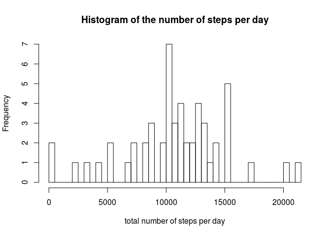
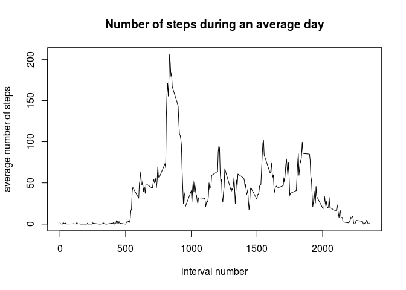
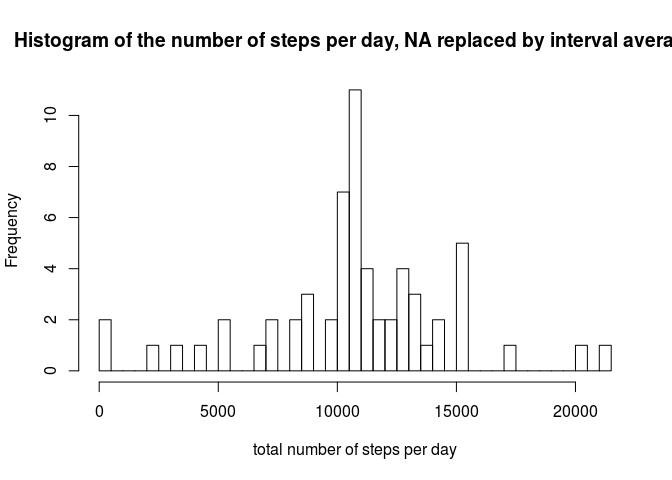

# Reproducible Research: Peer Assessment 1


## Loading and preprocessig the data

The data consists of two months of data from an anonymous individual collected during the months of October and November, 2012 and include the number of steps taken in 5 minute intervals each day.

```r
data <- read.csv("activity.csv") 
data_noNA <- na.omit(data)
```

## What is the mean total number of steps taken per day?

The number of steps are summed on all the intervals of every given day.

```r
tot_steps <- aggregate(data_noNA$steps,by=list("date"=data_noNA$date),sum)
hist(tot_steps$x, xlab="total number of steps per day", breaks=40,main="Histogram of the number of steps per day")
```

 


```r
mean_steps <- mean(tot_steps$x)
median_steps <- median(tot_steps$x)
```

The mean number of steps per day is 10766.19, the median is 10765.

## What is the average daily activity pattern?

The following plot is the average number of steps taken on each interval.

```r
daily_steps <- aggregate(data_noNA$steps,by=list("interval"=data_noNA$interval),mean)
plot(daily_steps$interval, daily_steps$x, type='l', xlab="interval number", ylab = "average number of steps", main = "Number of steps during an average day")
```

 


```r
max_steps <- max(daily_steps$x)
max_interval <- daily_steps$interval[which(daily_steps$x==max_steps)]
```
The maximum number of steps (206) per day on average occurs at interval 835.

## Imputing missing values

The data contains many missing values (NA).

```r
nbr_NA <- dim(data)[1]-dim(data_noNA)[1]
```
The total number of observations containing NA values is 2304 (13.11% of data). Only the number of steps column contains NA values. We replace the missing values by the average value for the corresponding interval. 

```r
naToMean <- function(x) replace(x, is.na(x), mean(x, na.rm = TRUE))
data_filled <- ddply(data, ~interval, mutate, steps=naToMean(steps))
new_tot_steps <- aggregate(data_filled$steps,by=list("date"=data_filled$date),sum)
hist(new_tot_steps$x, xlab="total number of steps per day", breaks=40,main="Histogram of the number of steps per day, NA replaced by interval average")
```

 


```r
new_mean_steps <- mean(new_tot_steps$x)
new_median_steps <- median(new_tot_steps$x)
```

The mean number of steps per day on the new data (NA replaced) is 10766.19, the median is 10766.19. The difference due to NA replacement is negligible.

## Are there differences in activity patterns between weekdays and weekends?

The following plot shows the number of steps as a function of interval (time of day) for an average week day and an average weekend day.

```r
data_filled$is.weekend <- as.factor(ifelse(weekdays(as.Date(data_filled$date)) %in% c("Samstag","Sonntag"),"weekend","weekday"))
new_daily_steps <- aggregate(data_filled$steps, by=list("interval"=data_filled$interval, "weekday"=data_filled$is.weekend), mean)
ggplot(new_daily_steps, aes(x=interval, y=x))+geom_line()+xlab("Interval")+ylab("Average number of steps")+facet_grid(weekday~.)
```

 


